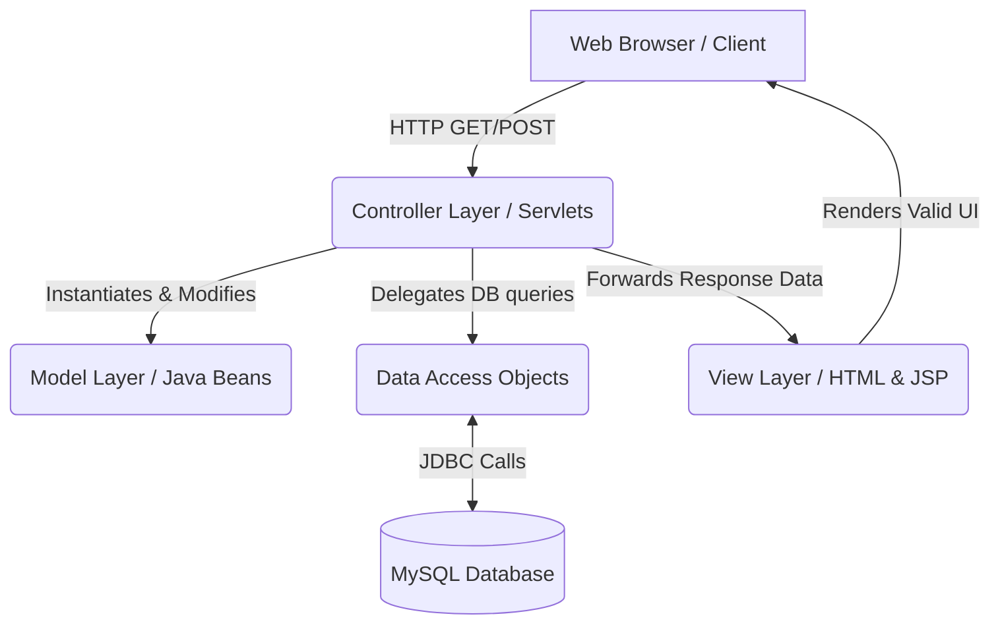
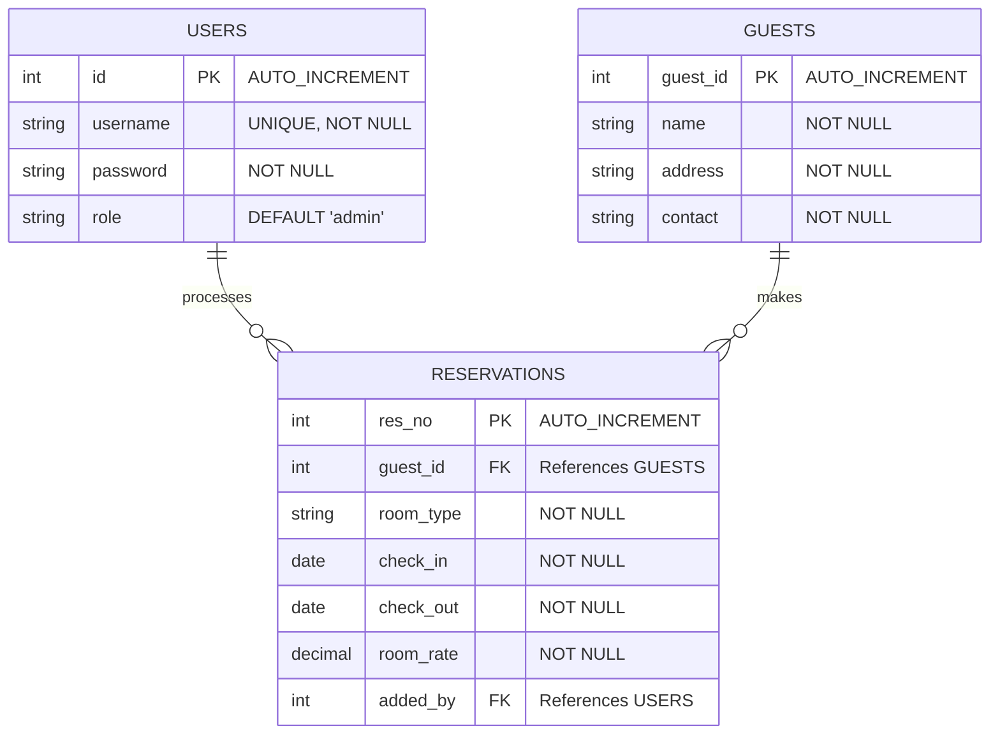
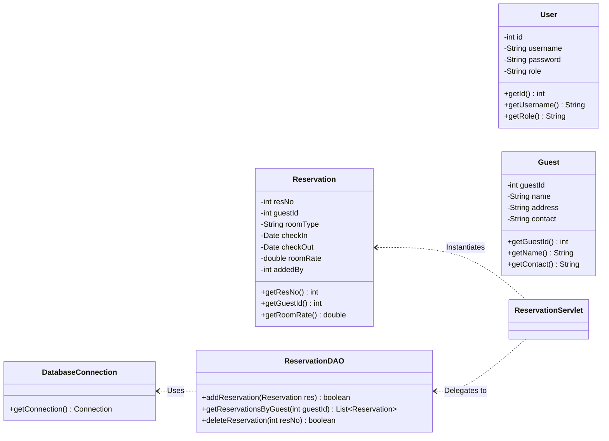
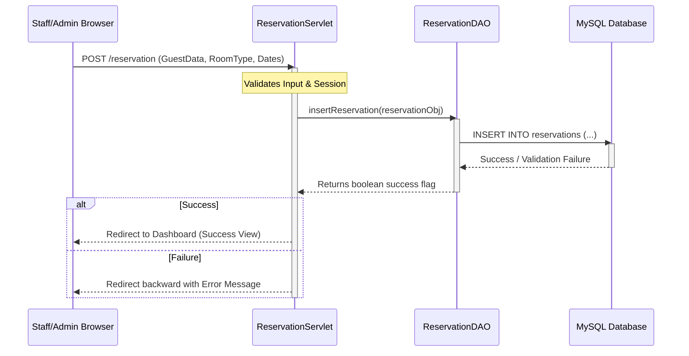

# 🌊 Ocean View Resort Reservation System


A robust, MVC-based Java Web Application tailored for managing resort reservations, guest data, and administrative billing. Built using traditional Java Servlets and JDBC, and deployed via Apache Tomcat, this system provides a scalable and secure foundation for single-property hospitality management.

## ✨ Features

- **User Authentication**: Secure login and registration for staff/admins with role-based access control.
- **Guest Management**: Register, update, and comprehensively manage guest profiles and contact details.
- **Reservation System**: Book rooms, track check-in/check-out dates, and accurately calculate room rates.
- **Billing & Administration**: Centralized dashboard to view active reservations and calculate billing seamlessly.
- **Dockerized Deployment**: Multi-stage Dockerfile for immediate deployment to cloud platforms like Railway.

## 🛠️ Technology Stack

- **Backend Logic**: Java 11, Java EE Servlets, JDBC
- **Frontend Views**: HTML5, CSS3, JavaScript (Vanilla), JSP
- **Database Engine**: MySQL 8.0
- **Build & Dependency Management**: Apache Maven
- **Web/Application Server**: Apache Tomcat 9
- **Containerization**: Docker

---

## 📐 System Architecture Context

The application strictly adheres to the **Model-View-Controller (MVC)** architectural pattern, separating data models, user interfaces, and control logic to ensure maintainability and scalability.



````

---

## 🎨 Design Patterns Utilized

This project leverages several classical software design patterns to ensure the codebase remains maintainable, scalable, and loosely coupled.

### 1. MVC (Model-View-Controller) Pattern
The entire application is structured around the MVC pattern to separate concerns:
- **Model**: Represents the data and business logic. Examples include `User.java`, `Guest.java`, and `Reservation.java`.
- **View**: Handles the presentation layer, primarily using standard HTML, CSS, and JSP pages (e.g., `dashboard.html`, `index.html`).
- **Controller**: Processes incoming HTTP requests, interacts with the model, and forwards to the appropriate view. The Java Servlets (e.g., `ReservationServlet.java`, `LoginServlet.java`) act as the controllers.

### 2. DAO (Data Access Object) Pattern
To abstract and encapsulate all access to the data source (MySQL), the DAO pattern is employed. It manages the connection to the data source to obtain and store data.
- **Example**: `ReservationDAO.java` handles all database operations (CRUD) exclusively for `Reservation` objects. Controllers simply call methods like `dao.addReservation(reservation)` without needing to know the underlying SQL queries or JDBC logic.

### 3. Singleton Pattern
The Singleton pattern ensures that a class has only one instance and provides a global point of access to it. This is highly efficient for managing expensive resources like database connections.
- **Example**: `DatabaseConnection.java` utilizes the Singleton pattern to provide a single, globally accessible, thread-safe database connection instance across the entire application.

```java
public class DatabaseConnection {
    // 1. Private static instance
    private static DatabaseConnection instance;

    // 2. Private constructor prevents instantiation from other classes
    private DatabaseConnection() { ... }

    // 3. Public static method to get the single instance
    public static synchronized DatabaseConnection getInstance() {
        if (instance == null) {
            instance = new DatabaseConnection();
        }
        return instance;
    }
}
````

---

## 🗄️ Database Schema & Entity-Relationship (ER) Diagram

The system employs a relational database structure with interconnected tables ensuring referential integrity via cascade rules.



---

## 🧩 UML Class Diagram (Models & DAO Structure)



---

## 🔄 Interaction Sequence Diagram: Booking a Reservation

The sequence below illustrates the lifecycle of a typical reservation request handled by the system.



---

## 🚀 Getting Started

### Prerequisites

- **Java Development Kit (JDK) 11** or higher
- **Apache Maven** 3.6+
- **MySQL Server** 8.0+
- **Docker** (Optional, for containerized environments like Railway)

### 1. Database Initialization

1. Access your MySQL CLI or GUI client (e.g., MySQL Workbench).
2. Execute the `database_schema.sql` script located in the project root. This creates the `ocean_view_resort` database, the necessary tables, and seeds a default administrative user (`admin2`/`admin123`).
3. Update specific database URL credentials (username/password) directly in `src/main/java/com/oceanview/config/DatabaseConnection.java` if your local environment utilizes different secure values.

### 2. Running Locally (No Local Tomcat Required)

The project utilizes the **Cargo Maven Plugin**, allowing the app to automatically provision memory, download Apache Tomcat 9, and host the web archive (`.war`) application seamlessly.

```bash
# Clean previous builds, compile the source files, and run the Cargo Tomcat container
mvn clean package cargo:run
```

Once the server initializes successfully, open `http://localhost:8080/` via any web browser.

### 3. Containerized Execution (Docker)

To build and execute the application locally within an isolated Docker Linux runtime:

```bash
# Construct the Docker image (Requires Docker Desktop/Engine)
docker build -t ocean-view-resort-app .

# Initialize the container, mapping host port to container port 8080
docker run -p 8080:8080 ocean-view-resort-app
```

---

## ☁️ Continuous Deployment Pipeline

This application is strictly optimized for modern cloud PaaS environments (like **Railway**, **Render**, or **DigitalOcean Apps**). The included multi-stage `Dockerfile`:

1. Constructs an intermediate isolated `maven:slim` build stage to resolve dependencies and compile the source `WAR`.
2. Extracts the compiled artifact and provisions it cleanly onto a minimal `tomcat:alpine` instance under the ROOT domain path seamlessly.

---

_Developed & Maintained by the Ocean View Resort Engineering Team._
